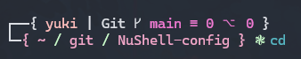
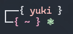

# NuShell-config

I wanted to share my shell configuration for NuShell, so here it is! Feel free to use as you wish


This is written and tested on windows machine, so make sure to change environment variables to match
your system variables if you use different system. eg $user_name

## Screenshots
 \\



Prequisites
- Git
- Neofetch
If you don't have neofetch installed or dont want to use it, please comment it out from the last line.


## Documentation
By default, on the top line it shows your user name.
When in git folder, it switches to git top line, wich shows in order from left to right
- Git .. Just means that you are in git folder
- Current branch
- Unstaged changes
- Untracked files


## Configuration
Username environment variable
```
let user_name = $env.USERNAME
```

Change this to change your preferred code editor
```
$env.config.buffer_editor = "code"
```
